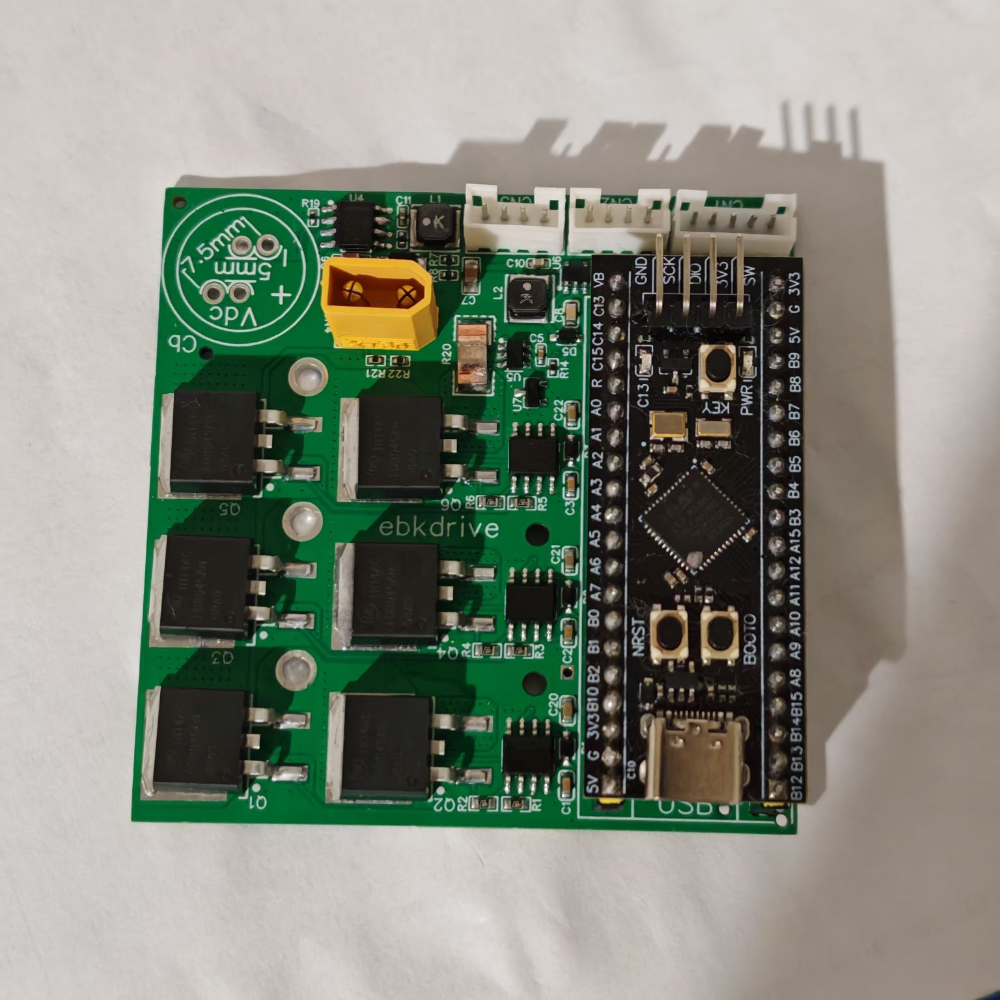

# ebkdrive
An open-source sensored BLDC controller board that integrates all necessary components into a compact form factor which is 65x65mm. I designed it to be cost effective and reliable solution for e-bikes, scooters, skateboards etc.
The controller integrates STM32 blackpill as the microcontroller. 
Buck converter on the board steps down a 36V battery input to 5V for powering the microcontroller. And a step-up converter boosts that 5V to 12V in order to supply the gate driver ICs. 
For now, it runs on open loop speed control by using a potentiometer which can be substituted for a throttle lever. 
The board is designed to work with 36 V but, considering the the parts I have chosen it should tolerate 48 V operation as well(Not tested yet).
Continious Current capacity : 15A
Peak Current : 30A

You can download and import the project to edit to your liking. Or, you can directly flash the ebkdrive.elf file in the debug folder. In either case you have to determine your phase directions by trying different phase and hall sensor arrangements according to your motor.
{width=100}
 
